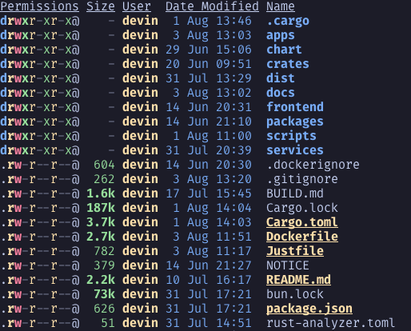

# Repo Structure
Obviously DLN (DevinLittle.net) is open source and I want to take a moment to explain the repository structure.

## Apps
This directory contains the source code of all the clients DLN offers.

## Chart
* Is currently empty But would have the helm chart

## Crates
In FOSS projects it's common to see a folder titled `crates` which is equivalent to the javascript `packages` directories. Crates contains rust libraries that other crates/binaries in this project rely on. The biggest/most important crate in this folder is the dln-core...More on that later in this book

## Dist
The Dist dir contains everything related to packaging...Thats kinda it.

## Docs
Docs contains this book. To note, there are docs directories inside some crates/bins in this project (ex. inside `backend-common` there is a docs dir), these include markdown files which are imported during the rustdoc stage, but that is just something I wanted to mention to clear up confusion.

## Frontend
Currently the `frontend` directory contains only 1 subsequent directory, which is titled `website`, this just contains the web app for DevinLittle.net and maybe if I have more web frontends, try to have two different versions of the site, ect. idk tbh?

## Packages
I explained this at [`crates`](#crates)

## Scripts
Scripts is a little bit more complex to explain without overloading you with buzzwords but, its mainly used by the build and packaging processes so yeah.

## Services
Contains all the backend services...That's literally it. I couldn't explain anymore than that. All services do get explained in a different chapter, so look there for more information on services.

